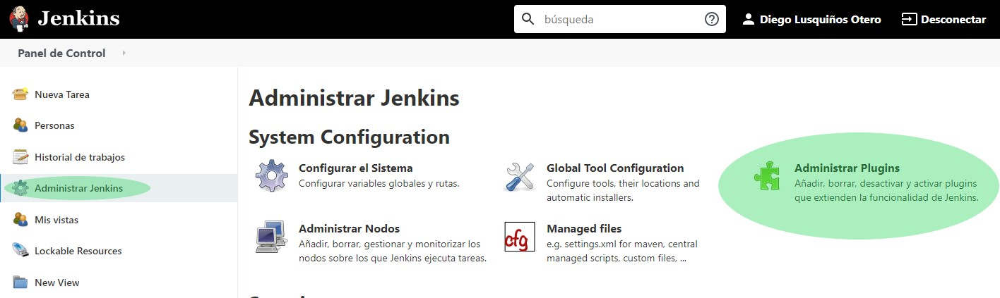
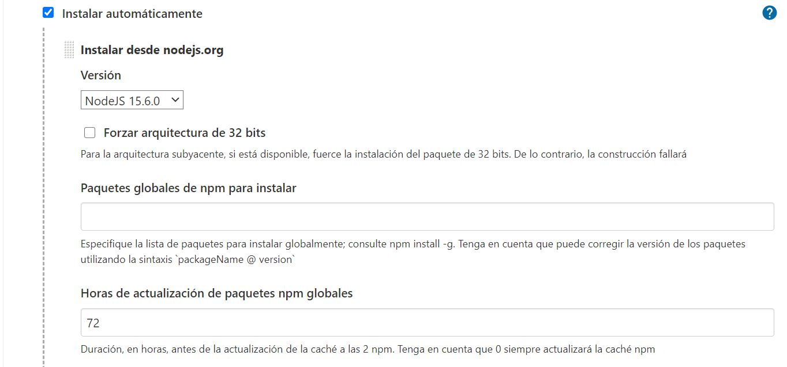
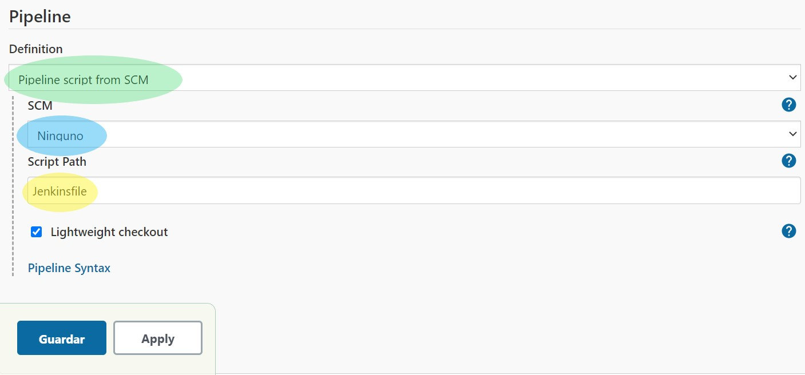
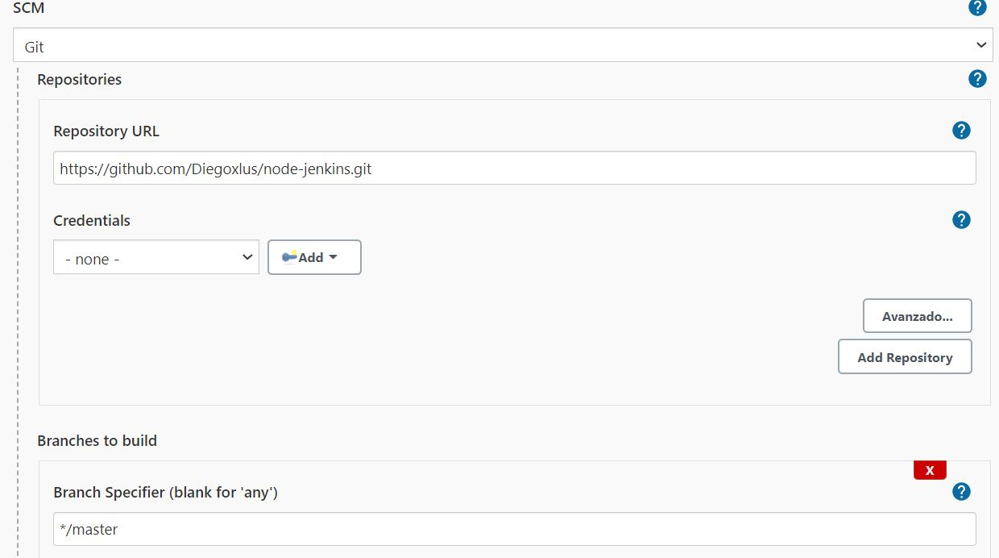
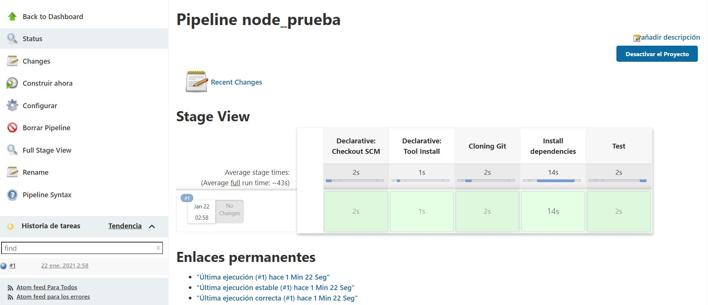

# Servidor Jenkins en Rasperry Pi

## :information_source: Con este ejemplo, os vamos a mostrar como automatizar el proceso de clonado, instalación y por último pruebas (Con Mocha y Chai) en una pequeña aplicación en NodeJS.

### :exclamation: Requisitos:

1. Tener una raspberry Pi con un SO GNU/Linux (Este ejemplo fue realizado con Raspbian).

   :link: [Como instalar Raspbian en tu Raspberri](https://geekland.eu/instalar-raspbian-con-raspberry-pi-imager/)

   

2. Habilitar SSH en la Raspberry para poder conectarnos con nuestro equipo y realizar la instalación de forma más cómoda (Se sugiere esta opción para no tener que manejar los dos equipos).

   :link:[Como abrir el puerto SSH en tu Raspberry](https://blog.ahierro.es/habilitar-acceso-ssh-a-raspberry-pi/)

   

3. Tener instalado Jenkins en la Raspberry

   :link: [Como instalar Jenkins en tu Raspberry](https://pimylifeup.com/jenkins-raspberry-pi/)

### :memo:Pasos a seguir:

1. Acceder al servidor Jenkins desde nuestro equipo

   

   
   
   *Simplemente tenemos que escirbir en la URL la IP de nuestra Raspberry seguido de : y el puerto 8080, a continuación nos autenticamos con el usuario creado en la instalación de Jenkins.*
   
   

2. Instalar el Plugin de NodeJS en nuestro servidor Jenkins

   

   

   *Accedemos al apartado "Administrar Jenkins" y después en "Administrar Plugins" buscamos el plugin NodeJS y lo instalamos*.

   

3. Ahora tenemos que instalar NodeJS en nuestra Raspberry, necesario para poder realizar la compilación de nuestros proyectos. De paso ya instalamos npm (Empleado para ejecutar comandos como npm install), y mocha (Empleado para lanzar los tests) .

   `pi:$ sudo apt install nodejs`

   `pi:$ sudo apt install npm` 

   `pi:$ npm install mocha` 

   

4. A continuación lanzamos el comando `pi:$ node -v`  que nos muestra la versión de nodeJS en nuestra Raspberry, supongamos que es la versión "X.X.X".

   

5. Para finalizar, solo faltaría configurar el plugin de NodeJS, indicándole la versión obtenida en el paso anterior. Para ello vamos a  :gear: Administrar Jenkins -> :hammer_and_wrench: Configuración global de herramientas y accedemos a "Añadir NodeJS", y veremos lo siguiente:

   

   

   *En la versión de node debemos indicar la versión instalada  y añadir la configuración. En paquetes globales podemos instalar todos los paquetes que necesite nuestro proyecto, eso sí, solo los globales. Si instalamos un paquete de forma global y se necesita en la carpeta node_modules del proyecto no va a funcionar (Un ejemplo claro es la instalación de "chai", empleado en los tests). Este paquete debe instalarse después de instalar el proyecto.*


6. Una vez  finalizada la configuración ya podemos crear nuestro "Pipeline". Vamos a "Nueva tarea" y accedemos a "Pipeline", le damos un nombre y seleccionamos la opción que nos permite obtener el archivo de configuración de Jenkins (Jenkinsfile) del repositorio de GIT.

   

   
   
   *:green_heart: En verde tenemos la opción que nos permite obtener el Pipeline del repositorio.*
   
   *:yellow_heart: En amarillo tenemos la ubicación del "Jenkinsfile", si el archivo se encontrase dentro de la carpeta "config" que cuelga del directorio principal la ruta sería: "config/Jenkinsfile"*.
   
   *:blue_heart: En azul tenemos el SCM, empleado para indicar de qué repositorio vamos a clonar el proyecto, las credenciales (en caso de que sean  necesarias) y la rama del proyecto que queremos probar, en nuestro caso la rama Master.*


   

   *En caso de que el repositorio fuera privado, necesariamente tenemos que añadir las credenciales de acceso*.


9. Ahora sí ya podemos construir nuestro proyecto con la opción  :clock10:Construir ahora. Una vez finalizado deberíamos ver lo siguiente:

   
   
   
   
      *En el caso de que algún paso fallase, este aparecería en color rojo y finalizaría la ejecución. Por lo tanto, no se ejecutarían los pasos siguientes.*


### :eye: ​ANÁLISIS DEL JENKINSFILE :eye:

```
pipeline {
  agent any
    
  tools {nodejs "node"}
    
  stages {
    /*
    1º Clonado de Git
    */
    stage('Cloning Git') {
      steps {
        git 'https://github.com/Diegoxlus/node-jenkins'
      }
    }
    /*
2º Instalamos el proyecto, necesario porque en Git no se guardan todas las dependencias   
del proyecto, en concreto la carpeta node_modules no se sube a Git por su tamaño.  
La instalación de chai es necesaria hacerla de forma local antes de lanzar los tests.
    
    */  
    stage('Install dependencies') {
      steps {
        sh 'npm install'
        sh 'npm install --save-dev chai'

      }
    }
/*
Por último, lanzamos los tests.
*/
     
    stage('Test') {
      steps {
         sh 'npm test'
      }
    }      
  }
}
```
