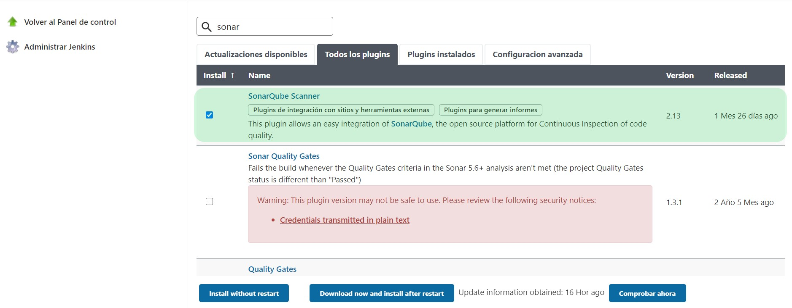
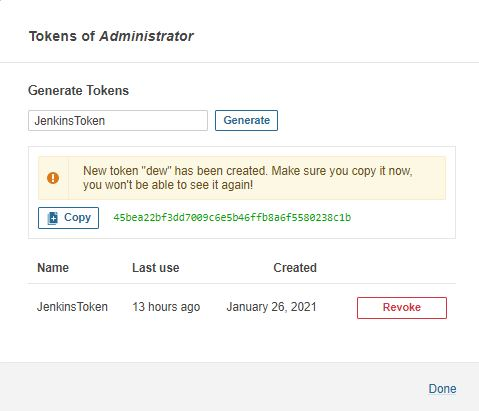
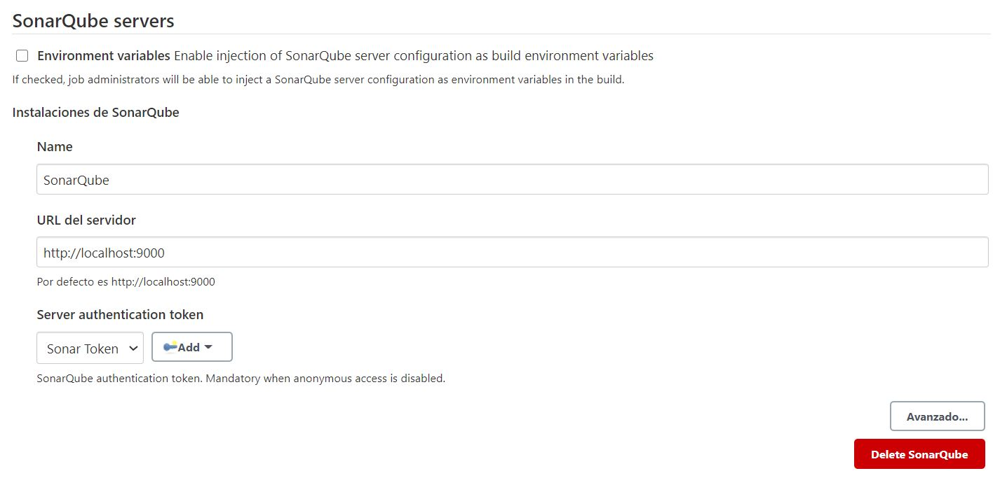
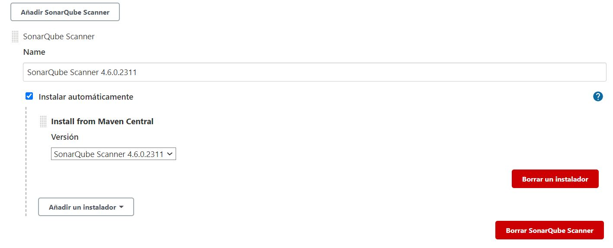
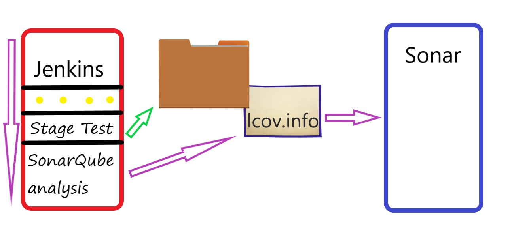

# :family_man_boy_boy::family_man_girl: Crear un hook a nuestro repositiorio de Git :family_man_girl::family_man_boy_boy:

## :arrow_forward: Objetivo: Integrar SonarQube en nuestro proyecto con la finalidad de que todo el equipo esté al tanto de la calidad del código.

### :book: Pasos a seguir:

- Descargar SonarQube en nuestra Raspberry y extraerlo donde queramos. Para este tutorial vamos a tomar la ruta */home/pi/sonarqube*, para ello renombramos la carpeta *sonarquebe-x.x.x.xxxxx* a "sonar", y el *sonarquebe-application-x.x.x.xxxxx.jar*, que se encuentra dentro de la carpeta */sonarquebe/lib*, a "sonar.jar". 

- Iniciar sonar cada vez que se arranca la Raspberry, para ello editamos el fichero *rc.local* que se encuentra en */etc*:

  `sudo nano /etc/rc.local`

  Antes del "exit 0" añadimos la siguiente linea:

  `java -jar /home/pi/sonarquebe/lib/sonar.jar`

  

  Ahora ya podemos iniciar sesión en SonarQuebe introduciendo en el navegador la ip de nuestra Raspberry seguido de :9000.

  La primera vez que entramos el usuario y contraseña por defecto es: "admin" en ambos casos. 

  

- Instalar el plugin "SonarQuebe Scanner" en el aparatado *Plugins* de Jenkins.

  
  
- A continuación, vamos a añadir el Token que nos va a permitir establecer la conexión entre Jenkins y SonarQube. Para ello, vamos a Administración :arrow_right: Security. Veremos el usuario *admin*, y un apartado "Tokens", desplegamos las opciones y generamos uno nuevo con un nombre. Posteriormente, copiaremos el valor del Token al portapapeles para emplearlo más tarde.

   

  

- Ya con nuestro Token en el portapapeles vamos a configurar el servidor Jenkins. Vamos a la opción :gear: Configurar el sistema y, al final de la configuración, nos encontramos lo siguiente:

  

  - Introducimos el nombre que le queramos dar, en mi caso "SonarQube", la URL donde se aloja nuestro servidor seguido del puerto y, por último, añadimos un nuevo token (es un "Secret Text" con el token obtenido del servidor de Sonar).

    

- Ahora vamos a configurar el "scanner" para SonarQube. Vamos a la opción :hammer:Global Tool Configuration, añadiremos la versión del scanner que vamos a utilizar y un nombre (Se recomienda el mismo, ya que posteriormente se escribirá en el Jenkinsfile y así sabremos siempre la versión del scanner).

   

- Ahora vamos a hablar de numerosos problemas que pueden surgir durante la instalación, por ello creemos que es necesario explicar cómo funciona Jenkins con Sonar.

  

  

  :red_circle: En color rojo tenemos nuestro servidor Jenkins con sus "Stages", en este caso nos vamos a centrar en los dos últimos.

  Stage Test, se encarga de comprobar si se pasan los tests pero, algo cambia con respecto a las versiones anteriores. Ahora los test se lanzan con el comando "npm run coverage", lanza los tests y analiza la cobertura del proyecto generando una carpeta "coverage" y dentro un fichero "lcov.info".

  

  :blue_heart: En color azul tenemos el servidor SonarQube, que analiza la calidad del código y muestra la cobertura del proyecto gracias al fichero "lcov.info" que le ofrece Jenkins.

  

- Por último, tenemos que añadir un archivo de configuración de SonarQube en nuestro proyecto, este se encuentra en el repositorio y se tiene que llamar "sonar-project.properties".


  

### 	:eye: Análisis del JenkinsFile :eye:

```
pipeline {
  agent any

  tools {nodejs "node"}

  stages {
    stage('Install dependencies') {
      steps {
        sh 'npm install'
        slackSend (color: '#00FF00', message: "Instalación de dependencias")
      }
    }
     
    stage('Test') {
      steps {
      /*
      Este step genera el fichero que necesita Sonar para analizar la cobertura del projecto (lcov.info).
      */
         sh 'npm run coverage'
         slackSend (color: '#00FF00', message: "Tests")
      }
    }
	/*
	Inicia el scanner con la versión que añadimos en la configuración (SonarQube Scanner 4.6.0.2311).
	En la linea que contiene: "withSonarQubeEnv('SonarQube')", SonarQube es el nombre que le dimos a 
	nuestro servidor.
	*/
    stage('SonarQube analysis') {
        steps {
            script {
                scannerHome = tool 'SonarQube Scanner 4.6.0.2311'
            }
            withSonarQubeEnv('SonarQube') {
            sh "${scannerHome}/bin/sonar-scanner"
            }
        }
    }
    
  }
  post {
    success{
        slackSend (color: '#00FF00', message: ":white_check_mark:INTEGRACIÓN CORRECTA :white_check_mark:")
    }

    failure {
        slackSend (color: '#00FF00', message: ":red_circle: INTEGRACIÓN INCORRECTA :red_circle:")
    }

  }
}

```

### 	:eye: Análisis del sonar-project.properties :eye:

```properties
##Clave única de proyecto.
sonar.projectKey=node-jenkins
##Nombre que se le quiera dar.
sonar.projectName=Simple JavaScript project analyzed with the SonarQube Runner
##Versión.
sonar.projectVersion=1.0
##Carpetas que vamos a analizar.
sonar.sources=app
##Lenguaje empleado.
sonar.language=javascript
##Codificación de los archivos.
sonar.sourceEncoding=UTF-8
sonar.dynamicAnalysis="reuseReports"
##Lugar donde se encuentra nuestro fichero de cobertura.
sonar.javascript.lcov.reportPaths="coverage/lcov.info"

```


Si todo funcionó correctamente, después de ejecutar la tarea en el servidor de Jenkins deberíamos ver lo siguiente al autenticarnos en nuestro servidor de SonarQube:


