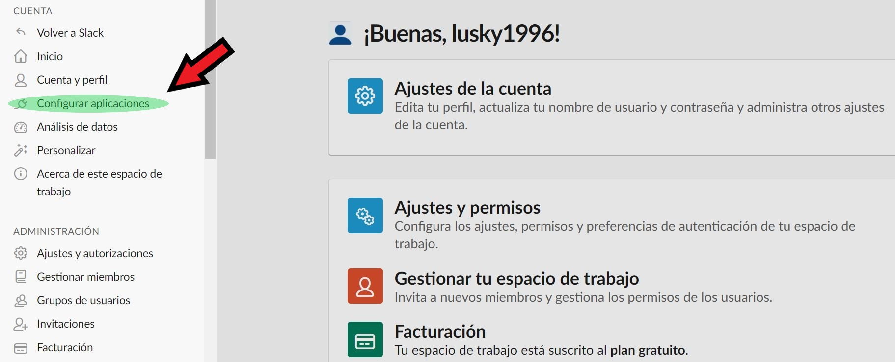
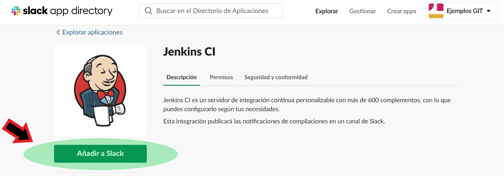
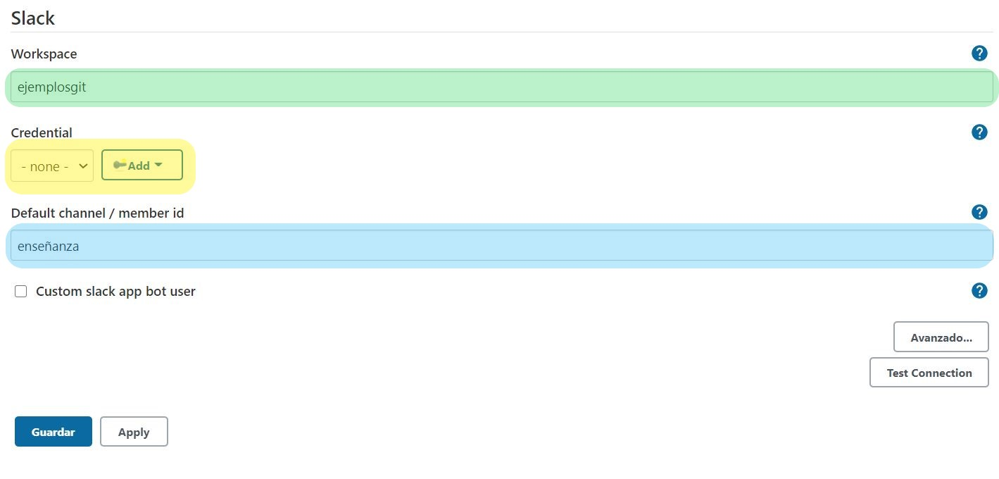
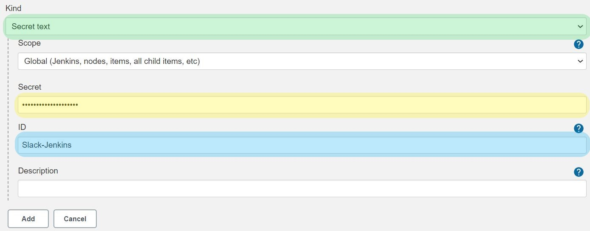
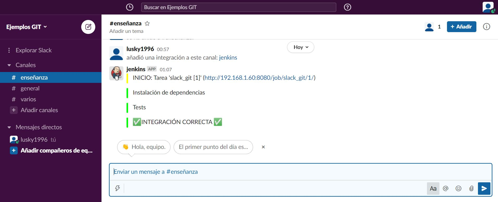

# :family_man_boy_boy::family_man_girl:Integración con Slack :family_man_girl::family_man_boy_boy:

## :arrow_forward: Objetivo: Integrar Slack en nuestro proyecto, con la finalidad de que todo el equipo esté al tanto del estado de cada integración.

### :book: Pasos a seguir:

- Instalar el plugin Slack Notification

  ​	:link: ​[Plugin Slack Notification](https://plugins.jenkins.io/slack/)

- Crear un nuevo espacio de trabajo

  ​	:link: [Crear espacio de trabajo en Slack](https://slack.com/get-started#/create)

- Integrar Jenkins en Slack, para ello vamos a nuestra cuenta, y seleccionamos la opción :electric_plug:Configurar aplicaciones.

  

- Y seleccionamos la opción "Añadir a Slack" que se ve en la imágen

  


- Cuando se acabe de añadir nos aparecerán una serie de pasos a seguir. Nosotros vamos a ir al final de la página y encontraremos los siguientes datos:

   

  :green_heart: En color verde tenemos el canal en el que se van a publicar las notificaciones, si nos fijamos debajo de la selección también tenemos la posibilidad de crear un canal nuevo.

  :blue_heart: En color azul, tenemos el token que vamos a necesitar para realizar la vinculación con Jenkins, vamos a guardarlo en el portapapeles para usarlo a continuación. En mi caso no lo muestro porque es único para cada proyecto. Si por algún motivo nos roban el Token, siempre podemos volver a generarlo, eso sí también debemos cambiarlo en la configuración de Jenkins.

  

- Ya con nuestro Token en el portapapeles vamos a configurar el servidor Jenkins. Vamos a la opción :gear: Configurar el sistema, y al final de la configuración nos encontramos lo siguiente:

  

  :green_heart: En color verde tenemos nuestro espacio de trabajo, si hacemos click sobre el nombre en nuestro espacio de trabajo se despliega en un pequeño menú. Justo debajo del nombre del espacio aparece una URL del tipo espaciox.slack.com, espaciox es el nombre que tenemos que introducir en este campo.

  :yellow_heart: En amarillo tenemos las credenciales, donde vamos a introducir el token ofrecido por Slack, lo veremos mas adelante...

  :blue_heart: En azul tenemos el canal donde se van a publicar las notificaciones, en mi caso tengo en mi espacio de Slack un canal llamado enseñanza.

  

- Ahora vamos con las credenciales, si nos fijamos en la parte subrayada con el color amarillo, tenemos la opción de añadir una nueva, si hacemos click sobre ella veremos lo siguiente:

  

  

  :green_heart: En color verde tenemos el tipo de secreto que vamos a escoger, en este caso como es un token, seleccionamos "Secret text"-

  :yellow_heart: En amarillo tenemos el token almacenado en el portapaples (Siempre puede volver a Slack y consultar el token). Simplemente tenemos que pegarlo.

  :blue_heart: En azul tenemos el nombre que le vamos a dar a nuestras credenciales, en este caso nosotros las guardamos con el nombre "Slack-Jenkins".

  

- Con toda la configuración lista, solo falta modificar nuestro JenkinsFile, este ejemplo es bastante sencillo, si quieres aprender más sobre los mensajes que envía Jenkins a Slack, consulta el siguiente enlace:

  :link: [Slack notification plugin](https://www.jenkins.io/doc/pipeline/steps/slack/#slacksend-send-slack-message)


### 	:eye: Análisis del JenkinsFile :eye:

```
pipeline {
  agent any
    
  tools {nodejs "node"}
    
  stages {
    stage('Cloning Git') {
      steps {
      /*
      Enviamos a Slack una notificación de color amarillo que indica el inicio, y va a contener:
      1) El nombre de la tarea
      2) El número de construción
      3) Y un enlace a la construción para poder consultarla en cualquier momento
      */
        slackSend (color: '#FFFF00', message: "INICIO: Tarea '${env.JOB_NAME} [${env.BUILD_NUMBER}]' (${env.BUILD_URL})")
        git 'https://github.com/Diegoxlus/node-jenkins'
      }
    }
        
    stage('Install dependencies') {
      steps {
        sh 'npm install'
        sh 'npm install --save-dev chai'
        /*
        Si la instalación se realiza correctamente se lo notificamos a Slack en color verde.
        */
        slackSend (color: '#00FF00', message: "Instalación de dependencias")
      }
    }
     
    stage('Test') {
      steps {
         sh 'npm test'
         /*
        Si los test se pasan correctamente se lo notificamos a Slack en color verde.
        */
         slackSend (color: '#00FF00', message: "Tests")
      }
    }      
  }
  /*
  post, se ejecuta siempre al finalizar todos los stage, podemos ejecutar acciones en el caso
  de que todo vaya bien (success), o en caso de que ocurra algún error (failure).
  */
  post {
    success{
    /*
     Si la integración se realiza de forma correcta se lo notificamos a Slack en color verde.
        */
        slackSend (color: '#00FF00', message: ":white_check_mark:INTEGRACIÓN CORRECTA :white_check_mark:")
    }
    failure {
    /*
    Si la integración falla se lo notificamos a Slack en color rojo.
        */
        slackSend (color: '#00FF00', message: ":red_circle: INTEGRACIÓN INCORRECTA :red_circle:")
    }
  }
}
```


- Si probamos ahora a construir nuestro proyecto desde Jenkins, deberíamos ver lo siguiente:

  
